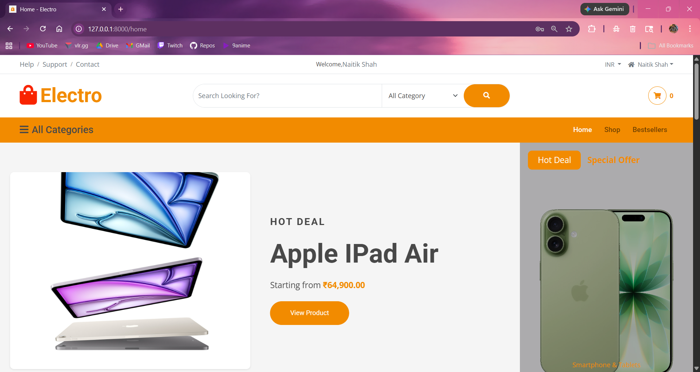
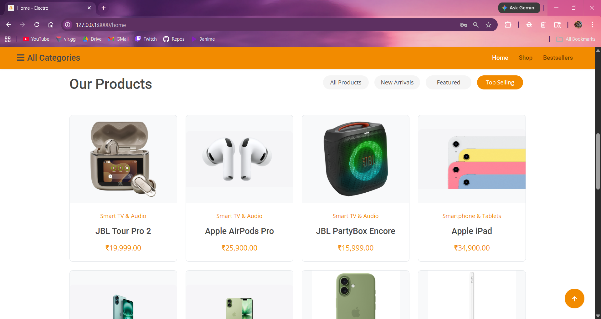
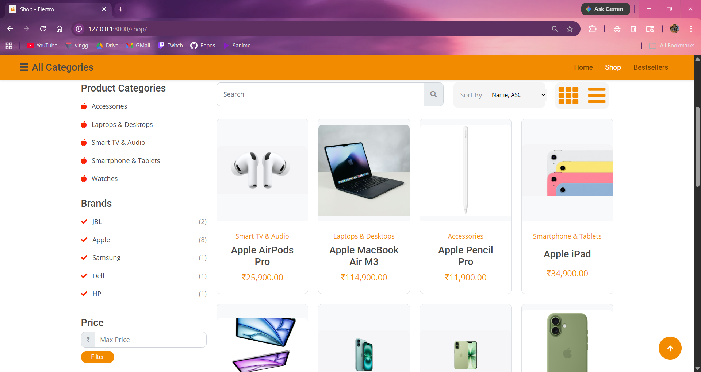
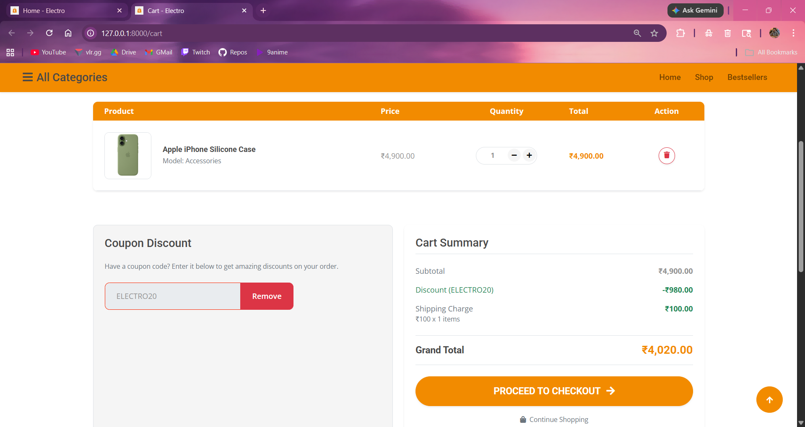
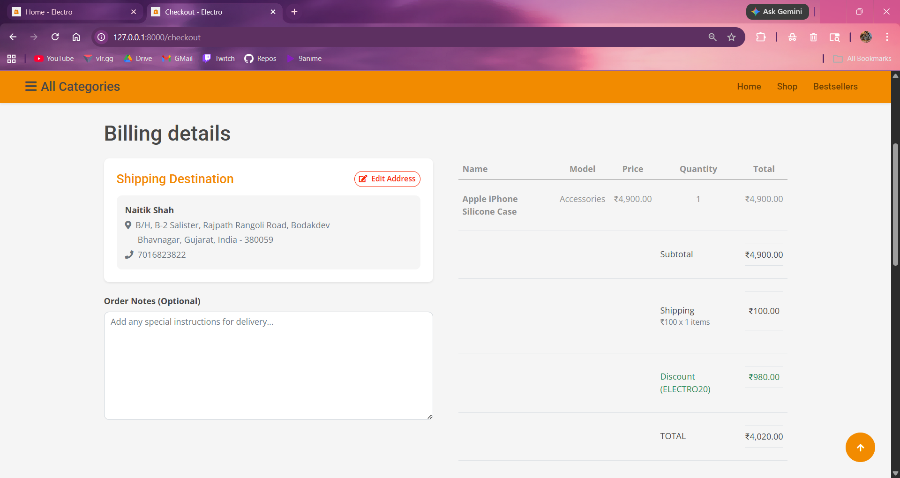
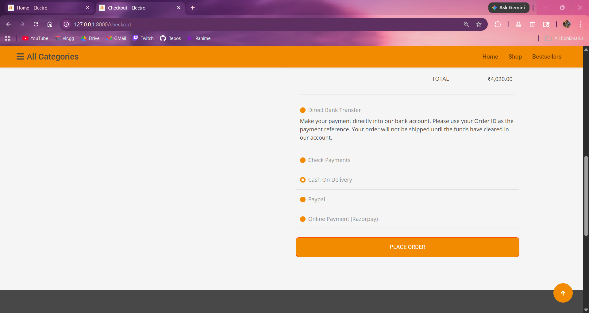
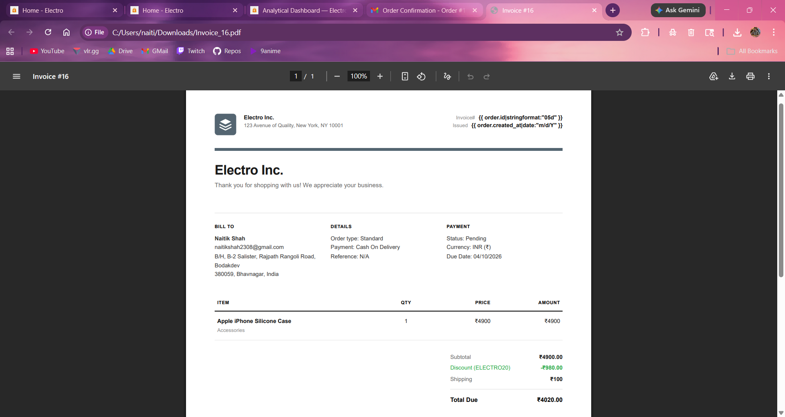
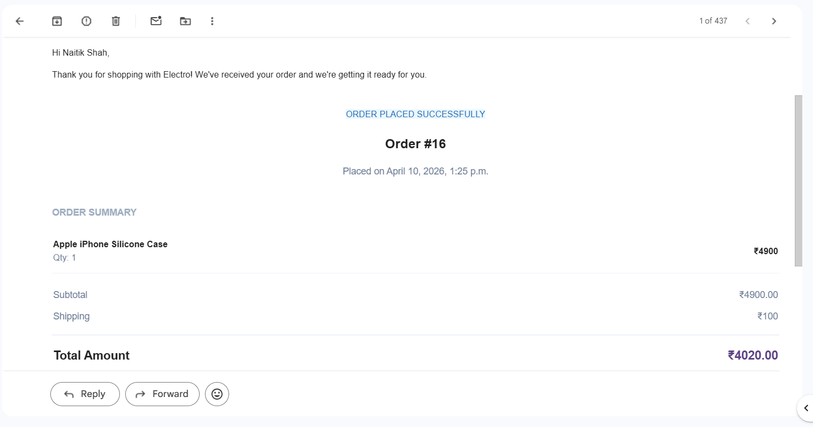

<div align="center">

<br/>

```
███████╗██╗     ███████╗ ██████╗████████╗██████╗  ██████╗
██╔════╝██║     ██╔════╝██╔════╝╚══██╔══╝██╔══██╗██╔═══██╗
█████╗  ██║     █████╗  ██║        ██║   ██████╔╝██║   ██║
██╔══╝  ██║     ██╔══╝  ██║        ██║   ██╔══██╗██║   ██║
███████╗███████╗███████╗╚██████╗   ██║   ██║  ██║╚██████╔╝
╚══════╝╚══════╝╚══════╝ ╚═════╝   ╚═╝   ╚═╝  ╚═╝ ╚═════╝
```

**A production-grade Django e-commerce platform built for the modern web.**

<br/>

[](https://python.org)
[](https://djangoproject.com)
[](LICENSE)
[](https://docs.pytest.org)
[](https://github.com/firstcontributions/first-contributions)
[](https://getbootstrap.com)
[](https://docs.pytest.org)


<br/>

</div>

---

## Table of Contents

- [Overview](#overview)
- [Features](#features)
- [Tech Stack](#tech-stack)
- [Getting Started](#getting-started)
- [Administrative Setup](#administrative-setup)
- [Project Structure](#project-structure)
- [Testing](#testing)
- [Security Architecture](#security-architecture)
- [Contributing](#contributing)
- [License](#license)

---

## Overview

**Electro** is a fully-featured, production-ready e-commerce platform built with Django. It ships with everything you'd expect from a serious commercial application — payment processing, inventory management, AI-powered sales forecasting, PDF invoice generation, and a custom admin dashboard — all wrapped in a glassmorphism dark-mode UI.

> Built to be extended, not just demoed.

---

## Features

### 🛒 Shopping Experience

| Feature | Description |
| --- | --- |
| **Product Browsing & Discovery** | Advanced catalog with brand-wise filtering, bestseller tracking, and real-time inventory indicators |
| **Multi-variant Ecosystem** | Relational schema supporting infinite variations (Color, Storage, etc.) with custom pricing, stock, and image galleries |
| **Product Comparison Suite** | Side-by-side analysis with visual diff highlighting, inline quantity steppers, and AJAX wishlist controls |
| **Product Image Gallery** | Interactive multi-image views with thumbnail navigation and mobile-optimized touch-swipe support |
| **Shopping Cart** | AJAX-powered cart with live state synchronization and toast notifications |
| **Wishlist Management** | Per-user product saving with AJAX live updates and a dedicated management interface |
| **Universal Star Ratings & Reviews** | Peer-review ecosystem with multi-layered duplicate prevention (IP/Session-based) and aggregated scores |

### 📦 Orders & Inventory

| Feature | Description |
| --- | --- |
| **One-Click Checkout** | Streamlined flow with profile-based pre-filling and secure status transitions |
| **Order Lifecycle Management** | Customer tools for Order History, Detailed Trackers, "Buy Again" (cart restoration), and Cancellation/Return requests |
| **Automated Order Notifications** | Event-driven HTML emails for Confirmation, Shipping, Delivery, and Returns |
| **Inventory & Stock Management** | Real-time validation, automatic deduction on purchase, and intelligent restoration upon cancellation |
| **Coupon Code Engine** | Rule-based promotional system with percentage/fixed discounts, usage limits, and PDF invoice integration |

### 🔐 Payments & Security

| Feature | Description |
| --- | --- |
| **Mock Payment Gateway** | End-to-end Razorpay (Test Mode) integration with HMAC-SHA256 signature verification and server-side finalization |
| **Invoice Generation** | Professional PDF billing using headless Playwright for pixel-perfect, zero-dependency rendering |
| **Comprehensive Error Handling** | Captures detailed context (code snippets, stack traces) for developers; clean UI for end users |
| **Automated Activity Logging** | System-wide event tracking stored in daily audit logs for security oversight |

### 📊 Admin & Analytics

| Feature | Description |
| --- | --- |
| **Custom Site Administration** | Isolated dashboard with BI charts (Chart.js), sales forecasting (scikit-learn), and multi-format exports (.pdf, .xlsx) |
| **Automated Testing Dashboard** | Full `pytest` suite with live terminal streaming and visual coverage reports in the admin panel |
| **Brand Management** | Dedicated ecosystem for managing brands with full relationship mapping to products |
| **Dynamic Currency Converter** | Site-wide reactive conversion using live exchange rates with a Two-Tier Caching strategy |

### 👤 User & Platform

| Feature | Description |
| --- | --- |
| **Centralized Profile Management** | Comprehensive dashboard for personal details, contact info, and multi-field shipping addresses |
| **Contact & Support Suite** | Integrated Contact forms, FAQ, Help docs, and Legal policies (Privacy, Terms) |
| **Product Pagination** | 3×4 grid layout with persistent filtering and sorting across all catalog views |
| **Isolated Asset Architecture** | Refactored frontend with strict separation of CSS/JS from HTML templates for better performance and CSP compliance |
| **Responsive Design** | Glassmorphism-inspired dark mode aesthetic |


---

## 🛠️ Tech Stack

### ⚙️ Backend

| Layer | Technology |
| --- | --- |
| Core Framework | [Django 6.0+](https://www.djangoproject.com/) |
| Database (Dev) | SQLite3 |
| Payment Gateway | [Razorpay SDK](https://razorpay.com/docs/) |
| AI & Forecasting | [scikit-learn](https://scikit-learn.org/) + [NumPy](https://numpy.org/) |
| Static File Serving | [WhiteNoise](https://whitenoise.readthedocs.io/) (with Brotli) |

### 🎨 Frontend

| Layer | Technology |
| --- | --- |
| Markup & Styling | HTML5, CSS3 (Glassmorphism), [Bootstrap 5](https://getbootstrap.com/) |
| Interactivity | JavaScript (ES6+), AJAX (Fetch API), [jQuery](https://jquery.com/) |
| Visualizations | [Chart.js](https://www.chartjs.org/) |

### 📄 Reporting & Documents

| Format | Library |
| --- | --- |
| PDF (Premium) | [Playwright](https://playwright.dev/) — headless browser rendering |
| PDF (Legacy) | [ReportLab](https://www.reportlab.com/) + [PyPDF2](https://pypdf2.readthedocs.io/) |
| Excel | [openpyxl](https://openpyxl.readthedocs.io/) |
| Word | [python-docx](https://python-docx.readthedocs.io/) |

### 🧪 Testing

| Tool | Purpose |
| --- | --- |
| [pytest](https://docs.pytest.org/) + `pytest-django` | Test framework |
| `pytest-cov` | Coverage reporting |
| `factory-boy` + `faker` | Data factories |
| `pytest-mock` | Mocking utilities |

---

## Getting Started

### Prerequisites

- Python 3.10+
- Node.js (required for Playwright's headless browser engine)
- Git

### Installation

**1. Clone the repository**

```bash
git clone https://github.com/TechieNaitik/electro.git
cd electro
```

**2. Set up a virtual environment**

```bash
python -m venv venv

# Windows
.\venv\Scripts\activate

# macOS / Linux
source venv/bin/activate
```

**3. Install dependencies**

```bash
pip install -r requirements.txt
playwright install chromium
```

**4. Configure environment variables**

Create a `.env` file inside the `myproject/` directory:

```env
SECRET_KEY=your-secret-key-here
RAZORPAY_KEY_ID=your-razorpay-key
RAZORPAY_KEY_SECRET=your-razorpay-secret
EMAIL_HOST_USER=your-email@example.com
EMAIL_HOST_PASSWORD=your-email-password
EXCHANGE_RATE_API_KEY=your-exchange-rate-api-key
```

> ⚠️ Never commit your `.env` file. It is already listed in `.gitignore`.

**5. Initialize the database**

```bash
cd myproject
python manage.py migrate
python manage.py createsuperuser
```

**6. Start the development server**

```bash
python manage.py runserver
```

Visit `http://127.0.0.1:8000` to see the app running.


---

## Administrative Setup

To access the custom site-admin dashboard, you need a `SiteAdmin` profile linked to a Django User.

**Method 1 — CLI (recommended for initial setup)**

```bash
python manage.py create_site_admin <username> <email> <password>
```

**Method 2 — Django Admin Panel (for team management)**

1. Log in at `http://127.0.0.1:8000/django-admin/`
2. Navigate to **Site Admins → Add Site Admin**
3. Enter credentials — the system automatically creates the linked Django User and hashes the password

---

## Project Structure

```text
electro/
├── LICENSE                    # MIT License
├── README.md                  # Project documentation
├── .gitignore                 # Git ignore rules
├── requirements.txt           # Python dependencies
├── screenshots/               # Screenshots of the project
└── myproject/                 # Django project root
    ├── manage.py              # Management utility
    ├── pytest.ini             # Pytest configuration
    ├── myproject/             # Project config (settings, urls, wsgi)
    └── myapp/                 # Core application
        ├── migrations/        # Database migration history
        ├── management/        # Custom management commands
        ├── services/          # Business logic: Coupon, Currency, AI Forecasting
        ├── static/            # Public assets (CSS, JS, images)
        ├── templates/         # HTML templates
        ├── tests/             # Unit and integration tests
        ├── admin.py           # Django admin config
        ├── apps.py            # App configuration
        ├── models.py          # Database models
        ├── urls.py            # URL routing
        └── views.py           # Views and business logic
```

---

## Testing

**From the terminal:**

```bash
pytest
```

Runs the full unit and integration test suite from the project root.

**From the admin dashboard:**

The built-in **Pytest Reports** view streams live test results and renders visual coverage maps — no terminal needed.

---

## Security Architecture

- **Secure Asset Management** — Strict physical separation of CSS/JS from HTML templates (100% extraction of inline scripts/styles)
- **Client/Server separation** — Strict boundary between public assets and private business logic

- **Secrets management** — All credentials externalized to `.env`; never exposed in `static/` or JavaScript
- **CSRF & session security** — Full Django middleware stack: CSRF protection, XSS filtering, signed sessions
- **Secure file serving** — Sensitive media and admin logs served via authenticated Django views, not raw static paths

---

## Preview

### 🏠 Storefront & Discovery


*Modern Landing Page with Interactive Carousel*


*Dynamic "Top Selling" and "Featured" Product Tabs*


*Advanced Product Catalog with Multi-Category Filtering*

### 🛍️ Shopping Experience


*Side-by-side Product Comparison with Difference Highlighting*


*AJAX-powered Shopping Cart with Live Quantity Updates*

### 💳 Checkout & Billing



*Streamlined Two-Step Checkout with Profile Autocomplete*


*Pixel-perfect PDF Invoices rendered via Playwright*


*Event-driven HTML Emails for Order Confirmation*

### 📊 Admin Intelligence & Analytics


*Custom Admin Portal with BI Charts (chart.js) and AI Sales Forecasting (scikit-learn)*

---

## Contributing

Contributions are welcome. To get started:

1. Fork the repository
2. Create a feature branch: `git checkout -b feature/your-feature`
3. Commit your changes: `git commit -m 'Add your feature'`
4. Push to the branch: `git push origin feature/your-feature`
5. Open a Pull Request

Please ensure all new features are covered by tests and that `pytest` passes before submitting.

---

## License

This project is licensed under the **MIT License** — see the [LICENSE](LICENSE) file for details.
---


<div align="center">

Built with Django · Styled with glassmorphism · Powered by Python

</div>